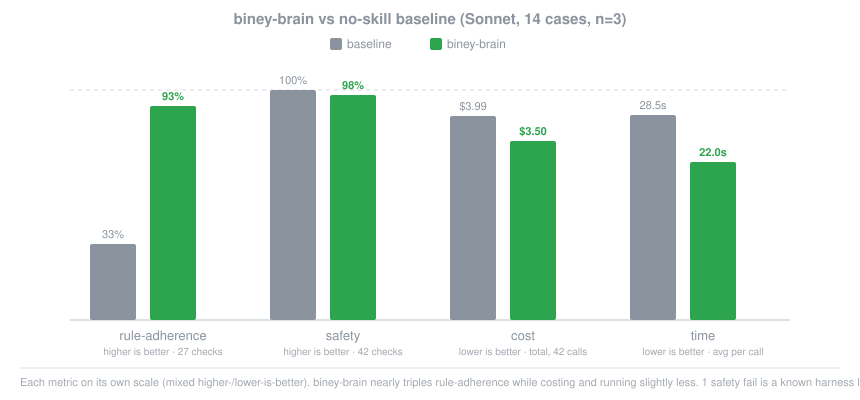

<p align="center">
  
</p>

<h1 align="center">biney-brain</h1>

<p align="center">
  <em>It's not that I know more. I've just already screwed this up before.</em>
</p>

<p align="center">
  <a href="https://github.com/biney-debug/biney-brain/blob/master/LICENSE"></a>
  <a href="https://github.com/biney-debug/biney-brain/stargazers"></a>
</p>

---

Installed `ponytail`, `caveman`, `security-and-hardening`, and still catch Claude Code making calls that aren't its to make: what stack for a 30-hour hackathon, how much security is actually enough here, whether this is the moment to commit? Those aren't code problems. No skill fixes them mid-task, because none of them were built to.

biney-brain is that missing judgment, packaged: exams solved by repeating the pattern that already worked, hackathons shipped in a rush, a thesis I'm working through right now that's forcing real answers instead of "feels right." Describe the situation, and it tells you whether an installed skill already covers it, or hands you the call directly when none of them do.

```
/plugin marketplace add biney-debug/biney-brain
/plugin install biney-brain
```

That's the whole install. Full steps, Codex CLI included, are further down.

## Before / after

You ask "what stack should I use for this 30-hour hackathon" and your AI hands you a microservices map with Kafka because "it scales better."

With biney-brain:

```
/biney-brain what stack should I use for a 30-hour hackathon
```

> This is a case for `biney-brain-stack`. Use what you already know, not what
> sounds better in the pitch. If you need something outside your skillset,
> don't improvise it: ask another AI for a detailed prompt for that specific
> piece and run it separately from the core.

No 3am argument about hexagonal architecture. No Kafka in a 30-hour MVP.

## Numbers

The honest measurement is a real agent doing real work: the same 14 prompts
run through `claude -p` twice, once with no plugin loaded and once with
biney-brain loaded, n=3, Sonnet, scored on whether the answer actually
contains the specific judgment call (not just a domain self-tag) and whether
it avoids the flagged wrong/risky phrasing.

<p align="center">
  
</p>

| arm | rule-adherence | safety | cost | avg time |
|---|--:|--:|--:|--:|
| baseline | 33% (9/27) | 100% (42/42) | $3.9924 | 28487ms |
| plugin | 93% (25/27) | 98% (41/42) | $3.4966 | 21976ms |

Loading biney-brain nearly triples rule-adherence, while costing and running
slightly less on average, the skill answer tends to be more direct where the
bare model hedges or lists options. The one safety dip and the one remaining
content miss are the same known harness limitation: the isolated test session
only loads biney-brain, so the one case that expects a hand-off to `ponytail`
can't succeed cleanly (`ponytail` genuinely isn't installed there). Full
per-case breakdown, method, and a companion single-arm self-tagging run
(Sonnet 12/14, Haiku 11/14 on whether the right domain tags itself):
[benchmarks/results/2026-09-22-arms-comparison.md](benchmarks/results/2026-09-22-arms-comparison.md)
and [benchmarks/results/2026-09-22-router-self-tagging.md](benchmarks/results/2026-09-22-router-self-tagging.md).

## How it works

A router (`biney-brain`) plus one domain per type of decision:

- `biney-brain-stack`: what technology to use depending on context (exam, hackathon, real client, personal research project), plus a table mapping specific stacks (Spring Boot, PostgreSQL, Angular, Power BI) to an installed skill that pairs with `ponytail`
- `biney-brain-personal`: stack, security tier, and how much polish matters for a project with no exam/hackathon/client/thesis behind it, a portfolio piece or a tool for friends
- `biney-brain-scope`: what to cut, postpone, or negotiate when time runs short
- `biney-brain-security`: how much security effort to put in and when it's not negotiable
- `biney-brain-tests`: when to write tests, when to test by hand, when to trust an AI audit, and which browser tool backs "verify for real" (`playwright-cli` by default, `claude-in-chrome` only for the user's real logged-in session)
- `biney-brain-git`: how to commit and branch even solo, and keeping docs from drifting behind the code
- `biney-brain-delegate`: how much you hand off to the AI, including running full auto mode without babysitting every step, and the two things that mean stop and look
- `biney-brain-model`: which Claude model to run a task on, Sonnet 5 by default, Opus 5 for design work, Fable 5 not needed so far
- `biney-brain-ai-usage`: what to do when the output comes out generic (find the skill that already solves it), and how to keep the session from auto-compressing on you
- `biney-brain-docs`: filling in and auditing a document in Google Docs by editing the **live** Doc in your own signed-in browser (needs `claude-in-chrome` connected and you already logged in, otherwise it says what's missing), copying the format of the finished sections and auditing the saved export until every check passes. Has its own section for thesis-style template documents
- `biney-brain-continuity`: how to keep project continuity across long sessions and `/clear`, without relying on conversation memory

Each one is a `SKILL.md`, concrete judgment, not pure theory. Don't need a domain, delete it. Missing one, add it the same way as the rest.

### You don't need to type `/biney-brain` for the judgment to kick in

The router loads on its own when you open a new session: a `SessionStart` hook (`hooks/session-start.sh`) injects the full content of `biney-brain/SKILL.md` into context before you type anything. That means **Claude already has the judgment loaded from the first message**, without depending on you or it catching it mid-conversation. If the project also has a `.biney-brain/STATE.md` (see `biney-brain-continuity`), that gets injected right after it, so a new session picks up where the last one left off instead of starting cold.

In practice: you paste a master prompt `.md` straight in, no `/biney-brain` in front, and Claude still checks whether the case qualifies (steps 1 and 2 of the router) and decides on its own whether to invoke `biney-brain-stack`, `biney-brain-scope`, etc. It's the same mechanism any skill uses to auto-invoke when its description matches the case, nothing exclusive to biney-brain.

`/biney-brain <situation>` still works, but it's there to force the question explicitly ("tell me which domain this falls under") when you want the router's answer directly, not a requirement for the judgment to apply.

Silent doesn't mean invisible, though: whenever a Step 2 domain (the personal-judgment ones, not `ponytail`/`caveman`/etc.) is what actually decides the response, it tags itself, one short line before continuing: `` `biney-brain-git`: commit manual, no auto. `` You see the call get made, not just the result.

## Skill roster

biney-brain doesn't do any of this by itself, it routes to skills that do. Most people install it first and nothing else, so here's everything it leans on:

- `ponytail`: keeps generated code minimal, YAGNI, stdlib first.
- `caveman`: keeps responses short, no wasted tokens.
- `security-and-hardening` (or the `/security-review` command): audits code for vulnerabilities.
- `ui-ux-pro-max` (or `frontend-ui-engineering` / `design`): data-backed UI/UX instead of default-generic design.
- `humanizer`: strips AI writing patterns out of a document, generated by biney-brain or handed to it already written (e.g. cutting a Turnitin-flagged score), mandatory whenever a document's on the table.
- `find-skills`: discovers and installs any of the above by name, the fallback for all of them.
- `agent-skills` (github: [addyosmani/agent-skills](https://github.com/addyosmani/agent-skills)): one plugin, not five separate installs, bundles `spec-driven-development`, `planning-and-task-breakdown`, `code-review-and-quality`, `frontend-ui-engineering`, and `security-and-hardening` among others.

If biney-brain tries to hand a case to one of these and you don't have it, it says so instead of faking the criteria. Once more than one comes up missing in the same session, it stops surfacing gaps one at a time and offers this whole list.

- `playwright-cli`: scripted browser automation and real Playwright test runs, default for verifying a UI/frontend change works.
- `claude-in-chrome`: drives the user's actual logged-in Chrome, only when the check needs their real session or it's a live interactive moment, and for editing a live Google Doc (`biney-brain-docs`), which only works with the Doc open in a browser where you're already signed in.

Stack-specific technical skills (Spring Boot, PostgreSQL, Angular, Power BI) aren't part of this universal starter pack, only install the ones matching your actual stack, see `biney-brain-stack`'s table.

## Install

### Claude Code

```
/plugin marketplace add biney-debug/biney-brain
/plugin install biney-brain
```

### Codex CLI

Codex CLI reads the same `SKILL.md` format, and this repo ships a `.codex-plugin/plugin.json` (same shape as `.claude-plugin/plugin.json`) so it can register as a plugin marketplace:

```
codex plugin marketplace add biney-debug/biney-brain
```

That registers the marketplace but doesn't install the skills yet. Codex's hooks (what would auto-load the router the way Claude Code's `SessionStart` does) are experimental, opt-in via `[features] hooks = true` in `~/.codex/config.toml`, and **disabled entirely on Windows regardless of that flag**, not a "still maturing" situation there, a stated platform exclusion. Install the skills for real with Codex's own built-in `skill-installer` instead: paste this into Codex CLI and it handles it.

```
Install these skills from github.com/biney-debug/biney-brain (branch master,
pass --ref master) into $CODEX_HOME/skills using skill-installer:
skills/biney-brain, skills/biney-brain-ai-usage, skills/biney-brain-continuity,
skills/biney-brain-delegate, skills/biney-brain-docs, skills/biney-brain-git,
skills/biney-brain-model, skills/biney-brain-personal, skills/biney-brain-scope,
skills/biney-brain-security, skills/biney-brain-stack, skills/biney-brain-tests
Then tell me when it's done and that I should restart Codex.
```

Once installed, the skills auto-invoke the same way they do on Claude Code, matched by description, no need to name them explicitly.

## Statusline badge (optional, for whoever installs it)

To get `[BINEY-BRAIN]` showing in your status bar, don't edit anything by hand: copy this prompt and paste it into Claude Code, it'll handle it:

```
I have the biney-brain plugin installed. Set up its statusline badge:
copy the file hooks/biney-brain-statusline.sh from the installed plugin to
~/.claude/hooks/, and add that script to my statusLine.command in
~/.claude/settings.json (chained with ; to whatever is already configured,
without deleting anything existing). Let me know when it's done.
```

Once that's done, `[BINEY-BRAIN]` shows up in your status bar the moment you open a new session. It's purely cosmetic: it means the plugin is available, it doesn't change how any response behaves.

## Use

```
/biney-brain <describe your situation>
```

Tells you which skill to delegate to, or the concrete judgment to apply if it's a call no code skill can make for you.

## Uninstall

Claude Code:

```
/plugin uninstall biney-brain
/plugin marketplace remove biney-brain
```

If you set up the statusline badge, also remove the `hooks/biney-brain-statusline.sh` line you added to `statusLine.command` in `~/.claude/settings.json`.

Codex CLI: delete each installed skill folder from `$CODEX_HOME/skills/` (`biney-brain`, `biney-brain-ai-usage`, and so on). If you ran `codex plugin marketplace add`, also run:

```
codex plugin marketplace remove biney-brain
```

## FAQ

**I only installed biney-brain, none of the skills it mentions. Is it useless without them?**
No. `biney-brain-stack`, `biney-brain-scope`, `biney-brain-security`, `biney-brain-tests`, `biney-brain-git`, `biney-brain-delegate`, `biney-brain-model`, `biney-brain-personal`, `biney-brain-ai-usage`, and `biney-brain-continuity` are all self-contained judgment, no dependencies. `biney-brain-docs` is the one exception: it needs `claude-in-chrome` connected and signed in to actually edit a live Google Doc. Only the Step 1 delegations (`ponytail`, `security-and-hardening`, etc.) need the actual skill installed, and biney-brain tells you exactly which one when it hits that case.

**Does this replace ponytail, caveman, security-and-hardening, or the rest?**
No, it routes to them. biney-brain doesn't write code, review security, or design UI, those skills already do that well. It decides which one applies, or hands you MRS's judgment when none of them cover the actual question (what stack, how much to cut, how much security effort, that kind of call).

**Why is it named after MRS specifically, can I use it if I'm not them?**
Yes. The domains are one specific person's real judgment, exams and hackathons already lived through, a thesis in progress right now, and criteria for freelance work worked out ahead of actually having a client. Documented as-is instead of watered down into generic advice, and marked as untested where it is. Use it as-is if it matches how you work, or fork the domains and put in your own answers, that's the whole point of it being plain `SKILL.md` files instead of something harder to edit.

**Can I add my own domain?**
Yes, that's how `biney-brain-personal` got added. Copy an existing `skills/biney-brain-*/SKILL.md` as a template, write the real judgment (not theory), then add a branch for it in `skills/biney-brain/SKILL.md`'s Step 2 flowchart.

**Does it work the same on Claude Code and Codex CLI?**
The judgment is identical, same `SKILL.md` files either way. The always-on part isn't: Claude Code force-loads the router at session start through a `SessionStart` hook out of the box. Codex's equivalent is experimental, opt-in via a config flag, and disabled outright on Windows no matter what you set, so on Codex the domains rely on being auto-invoked by description match instead, same as any other skill there, not "the router is always in context from message one" like on Claude Code.

---

MIT licensed, see [LICENSE](LICENSE).

<p align="center"><sub>Inspired by how <a href="https://github.com/DietrichGebert/ponytail">ponytail</a> is built. Same principle: the short answer someone with more scars than you already knows.</sub></p>
